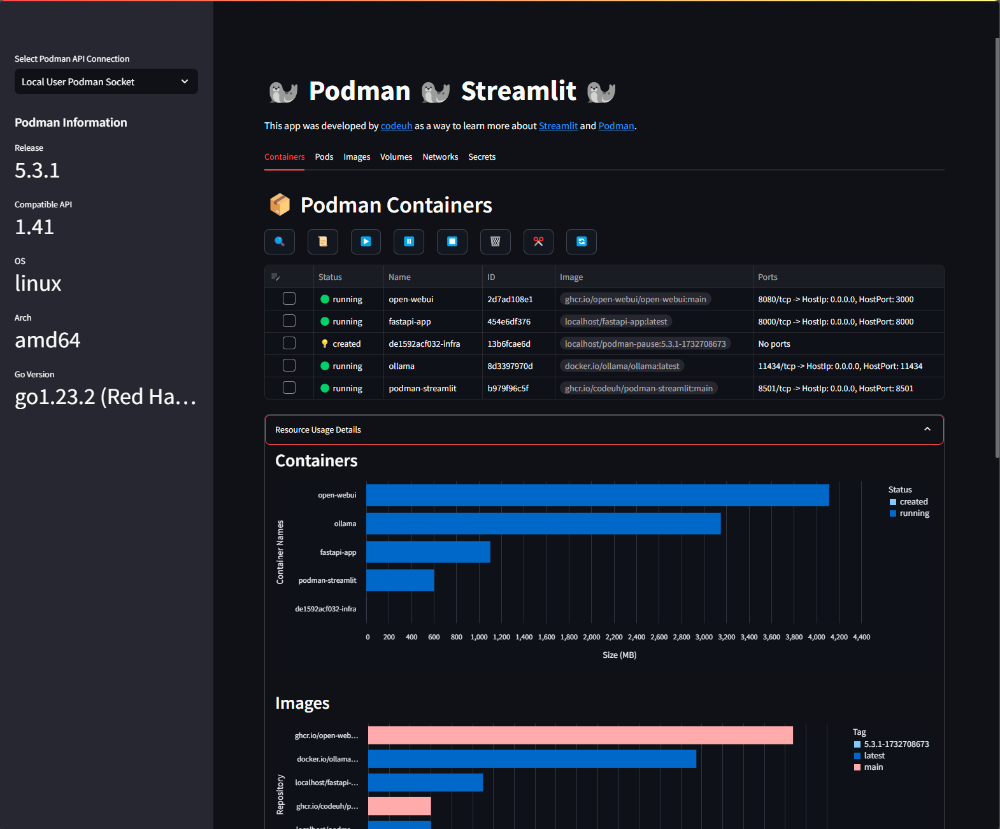

# podman-streamlit

[codeuh's](https://github.com/codeuh) work in progress [Streamlit](https://streamlit.io/) app that uses the [Podman PyPi package](https://pypi.org/project/podman/) for managing containers and images using [Podman](https://podman.io/).

# screenshot



# Run with Podman

I've only tested it running on a RHEL-9 WSL distro with Podman installed and working correctly. 

You can determine the path to your socket on a Linux machine with the following command:

````shell
podman info | grep sock
````

Expected output will look like this. If it's different then the run command, update the run command so the host podman socket mapping matches your output.

````text
path: /run/user/1000/podman/podman.sock
````

Here's the run command!

````shell
podman run -d --name podman-streamlit \
-p 8501:8501 \
-v /run/user/1000/podman/podman.sock:/run/user/1000/podman/podman.sock \
ghcr.io/codeuh/podman-streamlit:main
````
