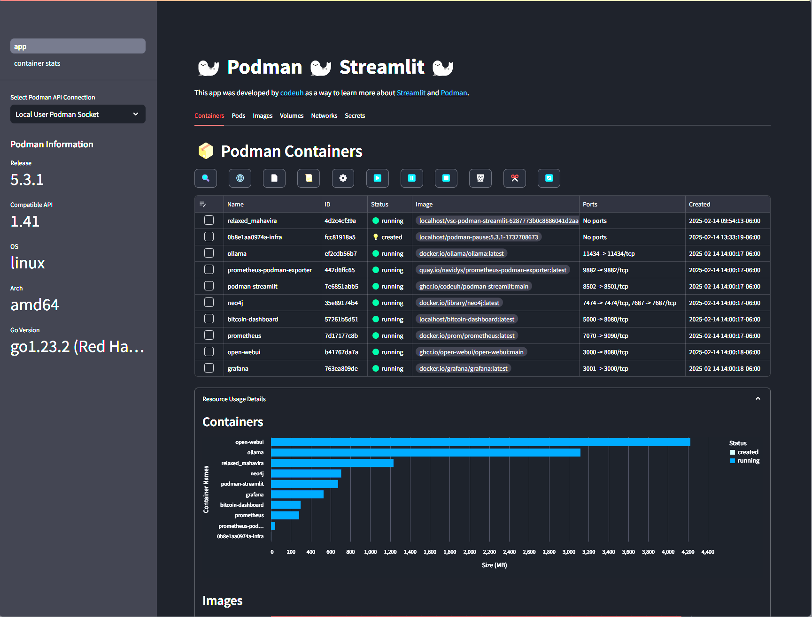

# podman-streamlit

[codeuh's](https://github.com/codeuh) work in progress [Streamlit](https://streamlit.io/) app that uses the [Podman PyPi package](https://pypi.org/project/podman/) for managing containers and images using [Podman](https://podman.io/).

# screenshots




# Run with Podman

I've tested it running on a RHEL-9 WSL2 distro and a Fedora 41 Workstation VM so far. 

You can determine the path to your socket on a Linux machine with the following command:

````shell
podman info | grep sock
````

Expected output will look like this. If it's different then the run command, update the run command so the host podman socket mapping matches your output.

````text
path: /run/user/1000/podman/podman.sock
````

Here's the run command!

````shell
podman run -d --name podman-streamlit \
-p 8501:8501 \
-v /run/user/1000/podman/podman.sock:/run/user/1000/podman/podman.sock \
ghcr.io/codeuh/podman-streamlit:main
````

# Current Features

* Main Page
    * Containers Tab
        * Inspect Container(s) JSON
        * Show Localhost Links to Container(s) Host Ports
        * Show Container(s) Logs with Syntax Coloring
        * Generate Quadlet for Container(s) via Podlet
        * Execute Commands in Container(s)
        * Start Container(s)
        * Pause Container(s)
        * Stop Container(s)
        * Remove Container(s)
        * Prune Containers
        * Refresh Containers
    * Pods Tab
        * Inspect Pod(s) JSON
        * Start Pod(s)
        * Pause Pod(s)
        * Stop Pod(s)
        * Remove Pod(s)
        * Prune Pods
        * Refresh Pods
    * Images Tab
        * Inspect Image(s) JSON
        * Pull Image(s)
        * Remove Image(s)
        * Prune Images
        * Refresh Images
    * Volumes Tab
        * Inspect Volume(s) JSON
        * Remove Volume(s)
        * Prune Volumes
        * Refresh Volumes
    * Networks Tab
        * Inspect Network(s) JSON
        * Remove Network(s)
        * Refresh Networks
    * Secrets Tab
        * Create Secret
        * Delete Secret
        * List Secret Names & IDs
    * Resource Usage Section
        * Containers Disk Usage Chart
        * Images Disk Usage Chart
        * Volumes Disk Usage Chart
        * Volumes with Reclaimable Space Chart
* Container Stats Page
    * Options
        * Container Selector
        * Chart Layout Selector
        * Chart Data Retention Period Selector
    * CPU Chart
    * Memory Chart
    * Network Traffic Chart

# Known Issues

1. The Container Stats page is using a while loop which isn't reccomended in streamlit. There's a bug in the code where if you navigate away from the stats page, then back to it, a Bad message format error occurs. You can refresh the page to get it working again.
2. The Container Stats page is assuming the network name. I need to make that dynaimc and selectable.
3. I had to disable SELinux by running the below command when I was testing it on Fedora 41 Workstation. Might there be a better way to hanlde this? I'm no SELinux expert.
````bash
sudo setenforce 0
````